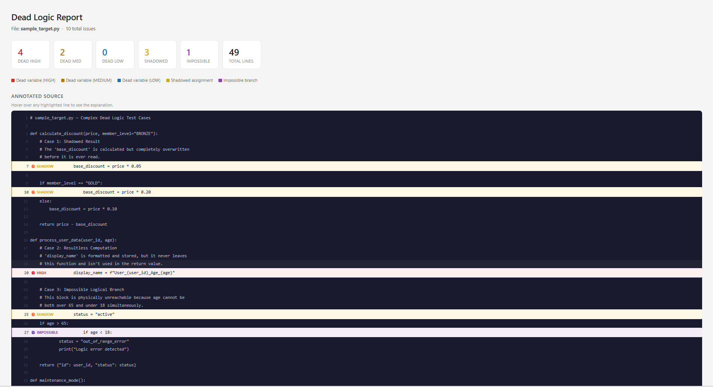

# Dead Logic Detector

A LangGraph-based agentic pipeline for detecting dead logic in Python code. Finds code that runs but has no real impact, using data flow analysis, symbolic execution, and LLM reasoning.

## Features

- **Data Flow Analysis**: Tracks variable usage and dependencies
- **Symbolic Execution**: Uses Z3 to verify conditions and paths
- **Graph Pruning**: Eliminates unreachable code paths
- **LLM Reasoning**: Groq (primary), with Gemini/Anthropic as fallback, for intelligent verdicts
- **Agentic Workflow**: Looping logic with confidence gates
- **Comprehensive Reporting**: HTML reports with annotations

## Installation

```bash
pip install -r requirements.txt
```

## Setup

Set your API key. Groq is checked first; if unset, the pipeline falls back to Gemini, then Anthropic:
```bash
export GROQ_API_KEY=your_key_here
# or
export GEMINI_API_KEY=your_key_here
# or
export ANTHROPIC_API_KEY=your_key_here
```

## Usage

### Command line

```bash
python pipeline.py <file.py> [api_key]
```
- `file.py` — the Python file to analyze
- `api_key` (optional) — passed directly; if omitted, falls back to `GROQ_API_KEY` / `GEMINI_API_KEY` / `ANTHROPIC_API_KEY` from the environment. Without any key, the pipeline still runs in heuristic-only mode (no LLM explanations).

Example:
```bash
python pipeline.py test_data/sample_target.py
```
Generates `test_data/sample_target_report.html` — open it in a browser to view the annotated report.

### As a library

```python
from pipeline import run

result = run("your_file.py", api_key="your_key")
print(f"Report: {result['report_path']}")
```

## Web App

A minimal Flask UI is included for uploading a file through the browser instead of the CLI.

```bash
python app.py
```
Then open `http://127.0.0.1:5000`, upload a `.py` file (optionally paste an API key), and it redirects to the generated HTML report.




## Pipeline Agents

1. **Parser**: AST parsing with Tree-Sitter
2. **Branch Detector**: Finds impossible conditions
3. **Tracer**: Data flow graph + dead variable detection
4. **Reasoner**: LLM verdicts with retry logic
5. **Reporter**: HTML report generation

## Datasets

All test/dataset files live in `test_data/`:
- `toy_dataset1.py`, `toy_dataset2.py`: Simple test cases
- `negative_tests.py`, `test_hard_negatives.py`: Code that looks dead but isn't
- `sample_target.py`, `large_file.py`, `all_test_cases.py`, `test_1.py`: Complex/aggregate examples

## Benchmarking

Compares results against Pylint and Vulture on a target file:
```bash
python benchmark.py test_data/sample_target.py
<<<<<<< HEAD
```
Generates `test_data/sample_target_benchmark.html` showing side-by-side findings across all three tools.

=======
>>>>>>> ff6e2355b75094f74a493286be44b9eb5291e135
```

## Architecture

- **LangGraph**: Orchestrates the agent workflow
- **Tree-Sitter**: AST parsing
- **NetworkX**: Data flow graphs
- **Z3**: Symbolic execution
<<<<<<< HEAD
- **Groq / Google GenAI / Anthropic**: LLM reasoning
=======
- **Groq / Google GenAI / Anthropic**: LLM reasoning
>>>>>>> ff6e2355b75094f74a493286be44b9eb5291e135
